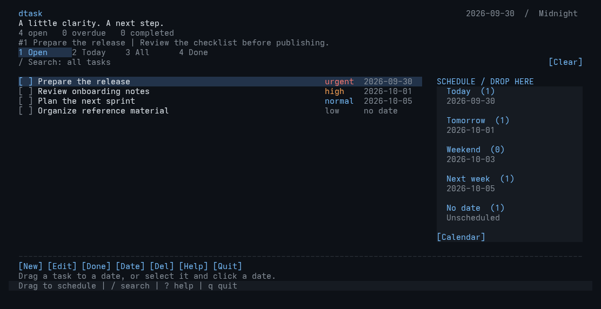

<p align="center">
  
</p>

# dtask

A focused D task manager for the terminal. Capture a next step, give it a
priority and due date, and keep the work that needs attention at the top.

dtask has a dark, configurable truecolor interface, keyboard and mouse
controls, local JSON storage, and a small CLI for scripts. It uses D's
standard library and native POSIX facilities, with no runtime packages,
network service, account, or background daemon.



## Build and run

Install [LDC](https://github.com/ldc-developers/ldc/releases) 1.43 or newer
and GNU Make, then run:

```sh
git clone https://github.com/GuestAUser/dtask.git
cd dtask
make
./bin/dtask
```

To choose a compiler explicitly:

```sh
make DC=/path/to/ldc2
```

Alternatively, with [DUB](https://dub.pm/):

```sh
dub build --compiler=ldc2
./bin/dtask
```

Install in your user's executable directory:

```sh
make install
# Default destination: ~/.local/bin/dtask
# Override with: make install PREFIX=/usr/local
```

The primary target is Linux, including WSL. The POSIX implementation is
also designed for macOS and FreeBSD: terminal handling uses `termios`,
`poll`, `ioctl`, and native character-width tables; storage uses advisory
file locking and atomic rename. A UTF-8 locale and ANSI/VT-compatible
terminal are required. Truecolor gives the intended palette. Native
Windows consoles are not supported; use WSL.

The workspace requires at least **48 columns by 20 rows**. At 110 columns
and 24 rows or larger, scheduling sections appear beside the task list.
Smaller terminals keep those same targets in a compact strip. A terminal
below the minimum gets a resize prompt.

## Fast mouse workflow

Click **New**, type a title, and click **Save**. To schedule it, drag the
task onto **Today**, **Tomorrow**, **Weekend**, or **Next week**. Release
over **No date** to unschedule it. You can also select a task and click
any of those targets directly.

For a specific day, click **Date** or **Calendar**. Use **Prev** and
**Next** to change months, then click the day. The calendar includes the
same quick presets, so most dates need no typing.

Click **Edit** to change a task. Choose priority with the visible buttons
and use **Pick date** for its due date. These changes remain a draft until
you click **Save**; **Cancel** discards them. Complete tasks with their
checkboxes, click the search line to filter, and click **Clear** to show
everything again. Help and Quit are also available on the toolbar.

While dragging, the target highlights and the status line previews its
date. Dropping outside a target, pressing Esc, or resizing cancels without
changing the task. Shift-drag may select terminal text instead, depending
on your terminal.

## Working with tasks

| Key | Action |
| --- | --- |
| `j` / `k`, arrow keys | Move selection |
| Home / End, `g` / `G` | First / last task |
| Page Up / Page Down | Move by one page |
| `n` | New task |
| `e`, Enter | Edit the selected task |
| Space | Complete or reopen |
| `p` | Cycle low, normal, high, urgent |
| `d` | Delete; `y` confirms and Esc cancels |
| `/` | Search titles and notes as you type |
| `1` / `2` / `3` / `4` | Open / Today / All / Done |
| Esc | Cancel a form/search, or clear the current search |
| `r` | Reload the selected theme file |
| `?` | Open help; arrows scroll it |
| `q`, Ctrl-C | Quit |

Click a row to select it, or its checkbox to complete/reopen it. View tabs,
the search line, action buttons, form fields, and Save/Cancel are clickable.
The mouse wheel moves through the task list; in the calendar it changes
the month.

In the editor, Tab moves between title, priority, date, and notes.
Ctrl-U clears a field; Backspace removes the character before the cursor.
Enter saves the entire form, Esc discards it. Arrow keys, Home/End, and Delete let you
correct text in place. Bracketed paste is accepted as text, not interpreted
as keyboard commands.

Dates accept `YYYY-MM-DD`, `today`, `tomorrow`, `fri`, `next monday`,
`next week`, `weekend`, `+7d`, or `in 7 days`. `next week` means the next
Monday; weekday names always mean the next occurrence, even when today
has that weekday. `weekend` means the nearest Saturday, including today
when it is Saturday. Use `none`, `no date`, or an empty field to unschedule.
Dates are local calendar days, so daylight-saving transitions do not turn
one day into zero or two.

The Today view includes overdue open tasks. Smart ordering places open
tasks before completed ones, overdue tasks before other open work, then
sorts by descending priority, ascending due date, and stable task ID.
Tasks without dates sort after dated tasks within the same priority.

## CLI

```sh
dtask add "Prepare the release" --priority high --due tomorrow
dtask add "Plan the next sprint" --due "next week"
dtask add "Read proposal" --notes "Check the migration section"
dtask list
dtask list --all --json
dtask done 1
dtask delete 1
```

`done` is idempotent: completing an already completed task does not reopen
it. `delete` is immediate on the CLI, while the TUI asks for confirmation.
Use `--data PATH` for a separate workspace and `--theme PATH` to select a
theme explicitly. `dtask --help` lists all options.

## Themes

The built-in theme is Midnight. Copy `themes/midnight.json` or
`themes/ember.json` to:

```text
$XDG_CONFIG_HOME/dtask/theme.json
# Default: ~/.config/dtask/theme.json
```

You can override only the values you want:

```json
{
    "name": "My midnight",
    "accent": "#C4A7E7",
    "selected": "#2A2440",
    "urgent": "#EB6F92"
}
```

Supported color keys are `background`, `panel`, `foreground`, `muted`,
`accent`, `selected`, `border`, `urgent`, `high`, `normal`, `low`, and
`success`. Colors must use `#RRGGBB`; unknown keys and malformed values
produce a clear error. The optional `name` appears in the header.

```sh
dtask --theme themes/ember.json
```

Press `r` after editing a loaded theme. A failed reload leaves the current
palette intact and displays the error. Restart dtask to discover a newly
created default theme when the session began without a theme file.

## Storage and recovery

The default store is `$XDG_DATA_HOME/dtask/tasks.json`, falling back to
`~/.local/share/dtask/tasks.json`. Parent directories are created as needed.
Mutations are saved immediately; there is no separate save command.

A store holds an exclusive advisory lock for its session. A second process
using the same file fails clearly rather than silently losing changes.
Close the TUI before using the CLI against that same store, or choose
another `--data` path. The `.lock` file may remain after exit; the operating
system releases the actual lock when the process closes.

Writes use a private temporary file, flush it, then rename it over the
destination. Invalid JSON, unsupported schema, malformed tasks, and
duplicate IDs are rejected without replacing the existing file. If you
edit the JSON manually, first close dtask and keep a backup. This is a
single-user local store, not a multi-user synchronization format.

Terminal mode, cursor, mouse tracking, and alternate screen are restored
on normal exit, Ctrl-C, and handled termination signals. Like other
terminal programs, dtask cannot clean up after SIGKILL, a terminal crash,
or power loss; use `reset` if your terminal remains in an unusual mode.

## Verification and development

```sh
make test
```

Tests are separate from application code:

- `tests/*_test.d` cover dates, sorting, storage, themes, input decoding,
  Unicode cell widths, and error handling.
- `tests/integration.py` drives the compiled CLI and a real pseudo-terminal,
  including mouse sequences, resizing, persistence, and terminal cleanup.

The integration script uses Python 3's standard library and event-driven
PTY reads with bounded timeouts, not fixed sleeps. Captures are temporary
and removed automatically. Set `DTASK_EVIDENCE_DIR=/path/outside/the/project`
to retain ANSI frames for visual inspection. See `CONTRIBUTING.md` for module
boundaries and code conventions.

## License

[MIT](LICENSE).
