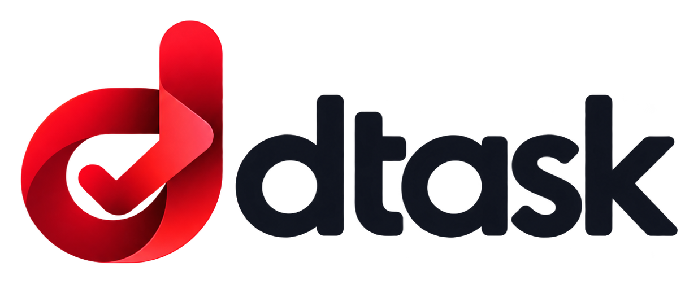
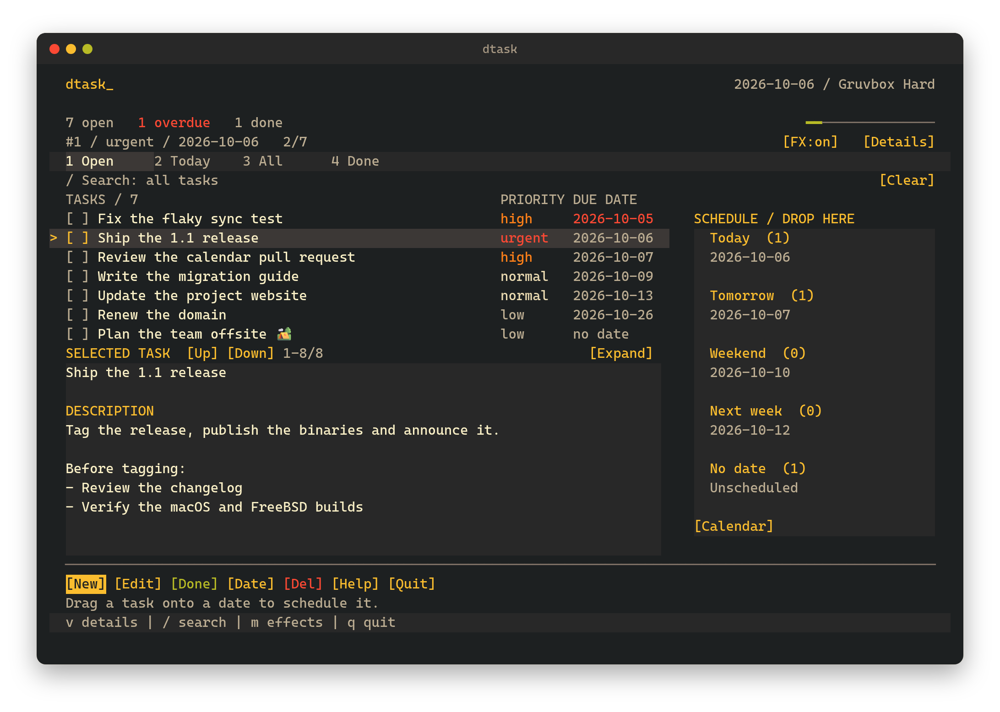
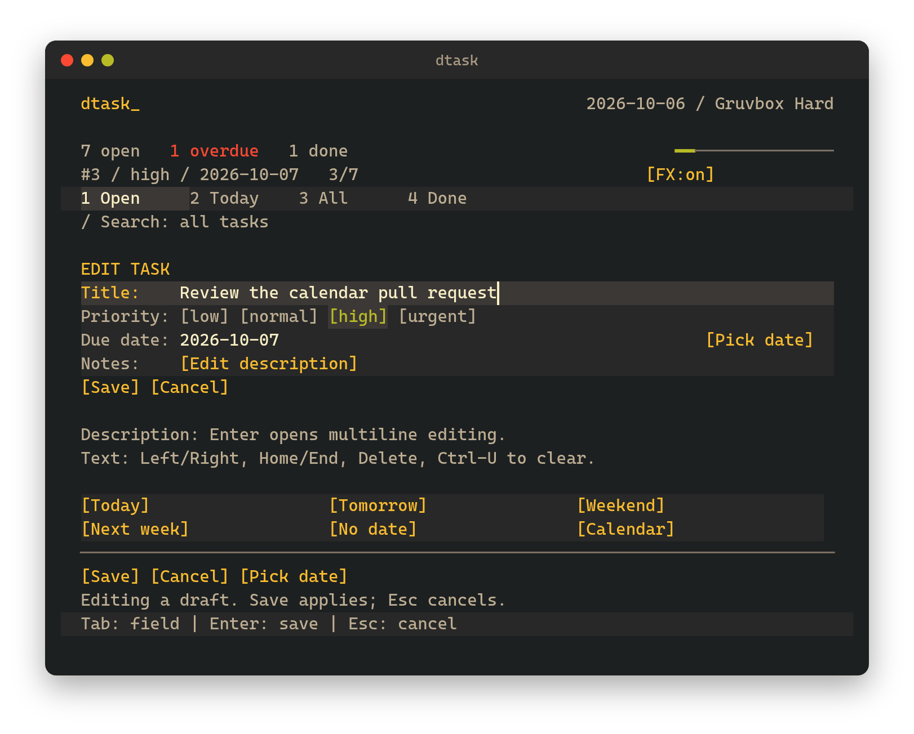
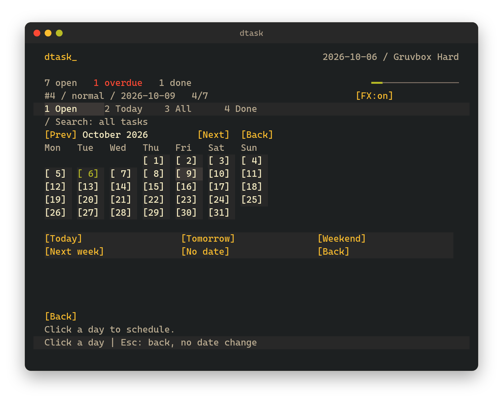

<p align="center">
  
</p>

<p align="center">
  A terminal task manager with keyboard and mouse controls.
</p>

<p align="center">
  
</p>

dtask keeps your tasks in a local JSON file and stays out of your way. Add a
task, give it a priority and a due date, and drag it onto another day when
plans change. It is a single native program written in D; there is no
account, service, or runtime to install.

## Features

- **Keyboard and mouse.** Navigate and edit from the keyboard, or click and
  drag: a due date opens its calendar, tasks drop onto a day, and the wheel
  moves one task at a time.
- **Natural dates.** Type `tomorrow`, `fri`, `next week`, or `+7d`, or pick a
  day from the calendar.
- **Notes.** Descriptions open in a scrollable reader and a multiline editor,
  and drafts are saved only when you choose.
- **Search and views.** Search titles and notes, and switch between the Open,
  Today, All, and Done views.
- **Themes.** Choose a built-in palette or configure your own in JSON, with
  live reload.
- **Safe storage.** Atomic saves, a single-writer lock, and editing that keeps
  accents, emoji, and CJK text intact.

<p align="center">
  
  
</p>

## Installation

### Prebuilt binaries

Download the archive for your system from [Releases](https://github.com/GuestAUser/dtask/releases/latest):
Linux x86_64, macOS Apple Silicon, or FreeBSD x86_64. Each archive contains
the executable, license, and example themes. Check the release notes for OS
requirements and verify your download against `SHA256SUMS`.

For example, on Linux:

```sh
tar -xzf dtask-v1.0.0-linux-x86_64.tar.gz
mkdir -p ~/.local/bin
install -m 755 dtask-v1.0.0-linux-x86_64/dtask ~/.local/bin/dtask
dtask
```

Use the matching archive and extracted directory on macOS or FreeBSD.
Add `~/.local/bin` to your `PATH` if needed. No compiler is required.

### From source

dtask needs [LDC](https://github.com/ldc-developers/ldc/releases) 1.43.0 or
newer and GNU Make.

```sh
git clone https://github.com/GuestAUser/dtask.git
cd dtask
./install.sh
```

The installer builds dtask and copies it to `~/.local/bin` without sudo. It
never edits your shell profile; if that directory is not on your `PATH`, it
prints the command to add it. Use `--prefix PATH` to install elsewhere and
`DC=/path/to/ldc2` to choose a compiler. On FreeBSD, run
`MAKE=gmake ./install.sh` and use `gmake` for the commands below.

To build without installing, run `make` and start `./bin/dtask`.
[DUB](https://dub.pm/) works too: `dub build --compiler=ldc2`.

dtask runs on Linux (including WSL), macOS, and FreeBSD. It needs a UTF-8
locale and an ANSI/VT-compatible terminal of at least 48 columns by 20 rows;
truecolor is recommended, and joined emoji need a terminal with
grapheme-aware cell widths. CI tests Linux x86_64, macOS arm64, and FreeBSD
14.4 x86_64; see the [compatibility notes](CONTRIBUTING.md#compatibility).
Native Windows consoles are not supported.

## Usage

Run `dtask` to open the workspace, and press `?` for the full shortcut
reference.

| Key | Action |
| --- | --- |
| `j` / `k`, arrows | Move the selection |
| `n` | New task |
| `e`, Enter | Edit the selected task |
| `v` | Read the full description |
| Space | Complete or reopen |
| `p` | Cycle priority |
| `d` | Delete, after confirmation |
| `/` | Search titles and notes |
| `1` `2` `3` `4` | Open, Today, All, Done |
| `m` / `r` | Toggle effects / reload the theme |
| Esc | Cancel, or clear the search |
| `q`, Ctrl-C | Quit |

Click a task to select it and its checkbox to complete it. Clicking a due
date opens the calendar, and clicking a priority opens the editor on that
field. To reschedule, drag a task onto **Today**, **Tomorrow**, **Weekend**,
**Next week**, or **No date**; Esc, a resize, or a drop outside the targets
cancels the drag.

In the editor, Tab moves between fields and **Edit description** opens a
multiline draft. **Save** applies your changes and **Cancel** discards them.
Pasted text is never treated as shortcuts.

Dates accept `YYYY-MM-DD`, `today`, `tomorrow`, weekdays such as `fri` or
`next monday`, `next week` (the next Monday), `weekend` (the nearest
Saturday), `+7d`, and `in 7 days`. Use `none` to clear a date. The Today view
also lists overdue tasks.

A slow glint marks focus, drop-target, and status changes, then settles. It
never delays input and stays off while you edit, search, or read help. Press
`m` to toggle it, or set `DTASK_REDUCED_MOTION=1` to start without it.

## Command line

```sh
dtask add "Prepare the release" --priority high --due tomorrow
dtask add "Review proposal" --notes "Check the migration section"
dtask list --all --json
dtask done 1
dtask delete 1
```

`done` is idempotent, and deleting from the command line is immediate; the
workspace asks first. Use `--data PATH` for a separate task file,
`--theme PATH` for a theme, and `--help` for every option.

## Configuration

| File | Default location |
| --- | --- |
| Tasks | `~/.local/share/dtask/tasks.json` |
| Theme | `~/.config/dtask/theme.json` |

`XDG_DATA_HOME` and `XDG_CONFIG_HOME` override the base directories. Changes
are saved atomically, and each open task file has a single writer, so close
the workspace before running the CLI on the same file.

The default theme is [Gruvbox Hard](themes/gruvbox-hard.json). Copy it,
[Midnight](themes/midnight.json), or [Ember](themes/ember.json) to the theme
location, or override only the colors you want:

```json
{
  "name": "Custom",
  "accent": "#83A598",
  "selected": "#504945"
}
```

Colors use `#RRGGBB`. Press `r` to reload the theme; an invalid file keeps the
current palette. A theme file created while dtask is running is picked up on
the next start.

## Development

```sh
make test
```

The suite covers the model and storage, input decoding, rendering helpers,
and real terminal sessions. Integration tests need Python 3.10 or newer and
use temporary task files. See [CONTRIBUTING.md](CONTRIBUTING.md) for build
options and conventions.

## License

[MIT](LICENSE)
